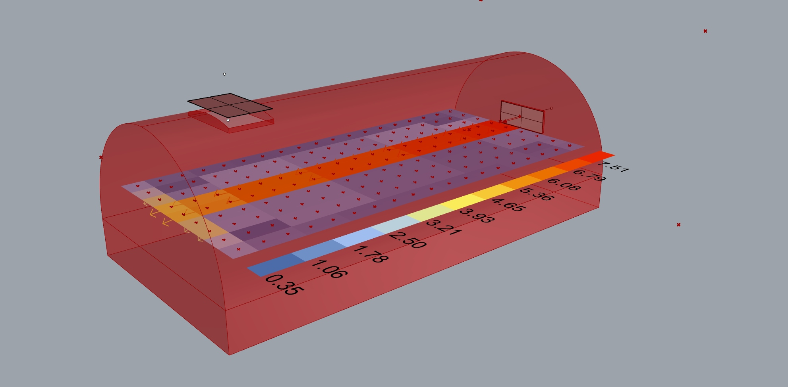
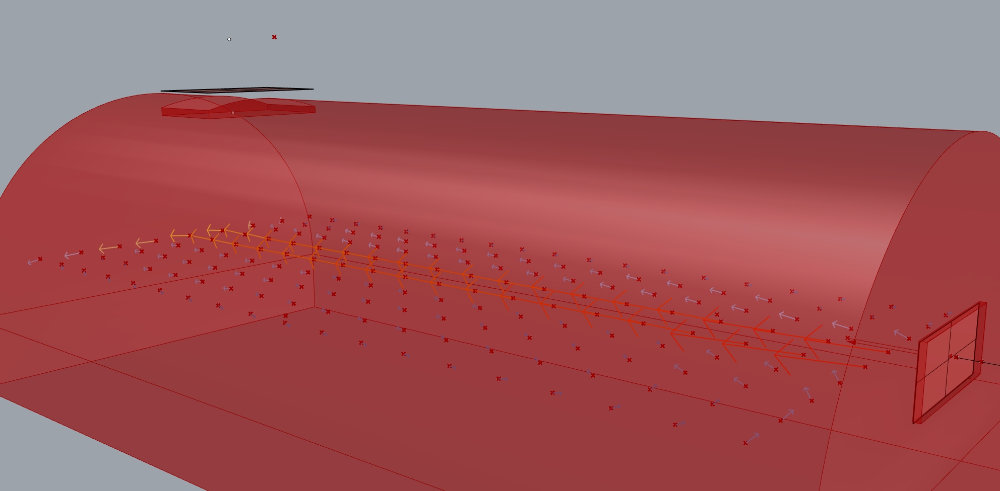
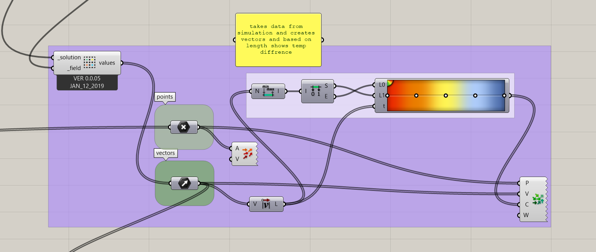
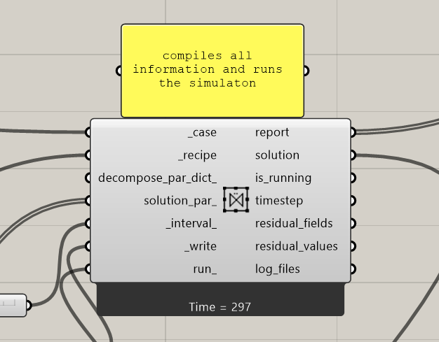
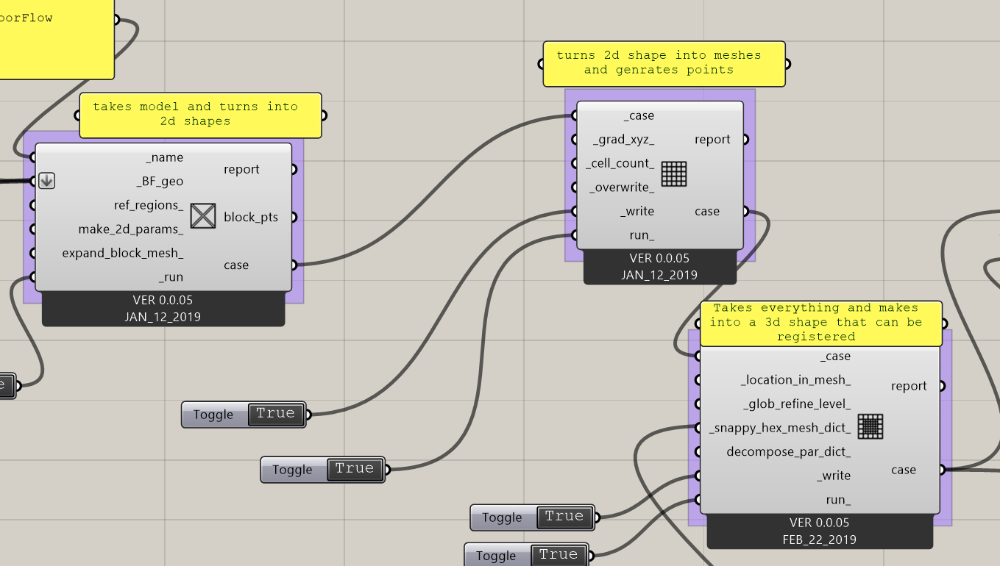
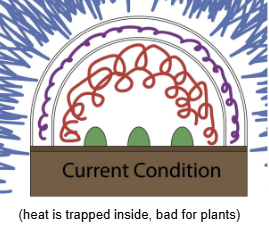
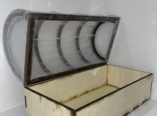
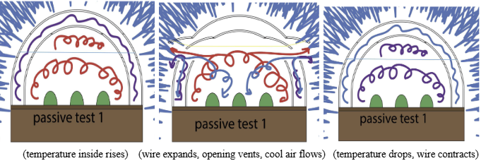
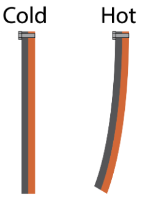

# Bloomin Beds

<div align="center">
  
  
  ### Innovative Garden Bed Monitoring System for Year-Round Sustainable Gardening
  
  
  
  
</div>

---

## 📖 About The Project

Bloomin Beds is a Directed Experimental Education / Internship Project developed by Professor Harris's class at Johnson & Wales University. It is an innovative garden bed monitoring system designed to address overheating in garden beds and promote year-round gardening through its integrated ventilation system, which is controlled via software. This allows the garden beds to be utilized effectively even during winter months.

The project utilizes a Raspberry Pi board and various sensors to create a user-friendly app and website where students can monitor the health of the plants by collecting valuable data on environmental conditions and plant growth. Additionally, Bloomin Beds simplifies gardening tasks for users, making it an accessible tool for both educational purposes and practical application in agricultural settings.

### Built With

* Raspberry Pi
* Python
* HTML/CSS/JavaScript
* Sensor Technology (Temperature, Humidity, Moisture)
* Real-time Data Visualization

---

## 🎯 Our Mission

Our mission is to enable year-round sustainable gardening through innovative technology and education. By combining automated ventilation control with comprehensive environmental monitoring, Bloomin Beds empowers students, culinary programs, and agricultural practitioners to optimize growing conditions, extend growing seasons, and make data-driven decisions. We strive to make advanced gardening technology accessible and practical for both educational settings and real-world agricultural applications.

---

## ✨ Key Features

- **Software-Controlled Ventilation System**: Automated climate control to prevent overheating and enable winter gardening
- **Real-Time Environmental Monitoring**: Track temperature, humidity, and soil conditions with live sensor data
- **Year-Round Growing Capability**: Extend your growing season through all four seasons, including winter months
- **Plant Health Tracking**: Monitor growth patterns and environmental impacts on plant development
- **User-Friendly Interface**: Access data and control systems through an intuitive app and website
- **Educational Platform**: Hands-on learning tool for students to understand agricultural technology and data analysis
- **Simplified Garden Management**: Streamlined controls make complex gardening tasks accessible to all skill levels

---

## 🖼️ Screenshots

### System Dashboard


*The main dashboard displays real-time environmental data from the garden beds, including temperature, humidity, and soil moisture levels.*

### Ventilation Control System


*Software-controlled ventilation system interface allows users to adjust airflow and temperature settings for year-round gardening.*

### Historical Data Tracking


*Track plant health over time with comprehensive data visualization tools and trend analysis.*

### Mobile-Friendly Design


*Access the Bloomin Beds system from any device with our responsive, mobile-friendly interface.*

---

## 🏗️ 3D Design & Ventilation System Simulations

The ventilation system at the heart of Bloomin Beds was designed and simulated using **Rhino 3D** modeling software. These simulations demonstrate the physical design of the garden bed structure, the integrated ventilation components, and how airflow is managed to maintain optimal growing conditions throughout the year.

### System Design Renderings

<div align="center">
  
  <p><em>Complete garden bed assembly showing ventilation integration and structural design</em></p>
</div>

<div align="center">
  
  <p><em>Detailed view of the ventilation system components and airflow channels</em></p>
</div>

### Component Design Details

<div align="center">
  <table>
    <tr>
      <td></td>
      <td></td>
    </tr>
    <tr>
      <td></td>
      <td></td>
    </tr>
    <tr>
      <td colspan="2" align="center"></td>
    </tr>
  </table>
  <p><em>Individual component views showing ventilation ducts, mounting systems, and structural elements</em></p>
</div>

### Design Features

The 3D modeling process helped optimize:
- **Airflow Pathways**: Strategic placement of ventilation channels for maximum efficiency
- **Structural Integrity**: Reinforced design to support year-round outdoor use
- **Sensor Integration**: Dedicated mounting points for temperature, humidity, and moisture sensors
- **Modularity**: Scalable design that can be adapted to different garden bed sizes
- **Weatherproofing**: Protected electronics housing and drainage systems

These simulations were crucial in validating the physical design before prototype construction, ensuring that the ventilation system would effectively prevent overheating while maintaining optimal growing conditions.

---

## 👥 Team

### Project Lead
**Jonathan Lyle Harris**  
*Educator and Designer*  
Jonathan Lyle Harris is an educator and designer focused on creating better environments for pedestrians and other non-motorized users. His work centers on human-scale public space, walkability, and the design of safer, more accessible streets and urban amenities.

### Development Team

**Michael Dattolo** - *Product Designer & Entrepreneur*  
Product designer with a hands-on, prototype-driven approach focused on turning early concepts into functional outcomes through practical problem-solving and iterative design.

**Liz Virian** - *Graphic Designer*  
Graphic designer with strengths in branding, visual identity, and web design, creating clean, user-friendly design systems across digital and print.

**Tyler Perreault** - *AI-Focused Professional*  
Aspiring AI-focused professional building experience at the intersection of emerging technology and day-to-day operations.

**Peikang Fan** - *Product Designer*  
Emerging product designer with a strong interest in building a foundation in product thinking and design execution.

**Zak Vallee** - *Honors Product Design Student*  
Honors Integrated Product Design student emphasizing improvement-driven design through analyzing existing products and refining form, function, and usability.

**Marshall Hayduk** - *Product Design Student*  
Product design student focused on challenging assumptions and pushing beyond standard solutions with a curious, concept-forward mindset.

**Chris Dimovski** - *Industrial & Product Designer*  
Industrial and product designer focused on user-centered solutions that improve performance and everyday experience through practical problem-solving.

**Keely Doyle** - *Product Designer*  
Product designer who prioritizes innovative, user-centered solutions with a craft-oriented perspective through jewelry design.

**Joshua Keene** - *Product Design Graduate*  
Integrated Product Design graduate with strengths in 3D modeling and system-level thinking, skilled in CAD-driven development and technical design work.

**Mathew Hartung** - *Product Designer*  
Product designer with a focus on sustainable design and innovative prototyping, exploring the intersection of traditional craftsmanship and modern materials.

---

## � Research & Development

### Project Overview

The Bloomin Beds project emerged from a recurring problem on the Johnson & Wales Harborside campus: automatically managing greenhouse ventilation based on temperature and weather conditions. During winter months, the greenhouse effect creates excessive heat during the day while temperatures drop at night, requiring active ventilation management.

Our team divided into two focused groups:
- **Passive Solutions**: Exploring non-electronic, mechanical means of ventilation
- **Active Solutions**: Developing sensor-based monitoring and automated ventilation systems

### Garden Bed Fundamentals

Through extensive research, we established critical parameters for optimal plant growth:

**Optimal Growing Conditions:**
- Temperature: 60-75°F (optimal: 80°F, maximum: 85°F)
- pH Levels: 6.0 - 7.0
- Soil Bulk Density: ≤1.3 g/cm³ (good), 1.3-1.55 g/cm³ (fair), >1.8 g/cm³ (poor)

**Garden Bed Specifications:**
- Width: 1.5 - 4 ft
- Length: 4 - 10 ft
- Height: 16-18 inches
- Materials: Wood composites, metal
- Winter covering: Double-layered plastic (4-8 mil thick, 2-8" gap)

### Prototype Development

#### Trapped Heat Problem
<div align="center">
  
  <p><em>Visualization of heat buildup inside the garden bed requiring ventilation</em></p>
</div>

The greenhouse effect causes dangerous temperature spikes inside covered garden beds, threatening plant health. Our research focused on both passive and active solutions to this critical problem.

#### Scale Model Testing
<div align="center">
  
  <p><em>Functional scale model with double-layer hoop cover for testing ventilation solutions</em></p>
</div>

A functional scale model was constructed using soil sampled from actual garden beds, allowing easier modification and testing than full-sized installations.

### Passive Ventilation Solutions

#### Thermo-Reactive Wire System (Test 1)
<div align="center">
  
  <p><em>Temperature-responsive wire mechanism for automatic vent operation</em></p>
</div>

**Design Features:**
- Thin spring steel bent over the cover
- Thermo-reactive metal wire attached to vent flaps
- **Operation**: As temperature rises, wire expands and opens vents; when cooling, wire contracts and closes vents
- Fully mechanical with no power requirements

#### Bi-Metal Strip System (Test 2)
<div align="center">
  
  <p><em>Bi-metal strip temperature-responsive ventilation mechanism</em></p>
</div>

**Design Features:**
- Bi-metal construction (copper + steel)
- High thermal expansion coefficient side (copper) paired with low coefficient side (steel)
- **Operation**: Temperature fluctuations cause differential expansion, bending the strip to open/close vents
- Passive operation requiring no electricity

### Active Ventilation Solutions

**Michael Dattolo's Innovations:**
1. **Rotating Shade/Open Mechanism**: Dynamic shading system providing temperature-responsive light exposure
2. **Pneumatic Lift System**: Automated bed opening and venting mechanism
3. **Rhino/Grasshopper 3D Simulation**: Demonstrated ventilation benefits with side and top holes, visualizing airflow and temperature reduction

**Comprehensive Control System Features:**
- Real-time monitoring via web portal
- Temperature and humidity regulation
- Integrated lighting control
- Year-round gardening capability
- Data-driven decision making
- Energy savings through optimization

### Weather Considerations

**Winter Conditions (December - February):**
- Average High: 46°F
- Average Low: 21°F
- Sky Condition: Partly cloudy

**Material Research:**
Weather-resistant materials investigated include:
- High-strength polymers
- Weather-responsive materials
- Phase-change materials (rubber, bi-metals, wax)

### Design & User Experience

**Brand Identity:**
- Custom logo incorporating plant and covering elements
- Responsive design with nature-inspired elements
- Aligned with JWU brand and sustainability standards

**Digital Platforms:**
- Condensed mobile app interface
- Sitemap-driven design flow
- CSS-styled website matching brand guidelines
- User-friendly data visualization

### Key Research Contributors

- **Joshua Keene & Marshall Hayduk**: Garden bed specifications and optimal growing conditions
- **Chris Dimovski**: Greenhouse systems, materials research, and environmental optimization
- **Tyler Perreault**: Arduino sensor coding and ventilation design concepts
- **Michael Dattolo**: Active prototypes, 3D simulation, and integrated control systems
- **Mathew Hartung**: Passive ventilation prototypes and scale model development
- **Keely Doyle**: Weather analysis and phase-change materials research
- **Liz Virian & Cassandra**: Brand identity, app design, and web interface

---

## �🚀 Getting Started

### Prerequisites

- Raspberry Pi (Model 3B+ or newer recommended)
- Python 3.7+
- Sensor hardware (DHT22 for temperature/humidity, soil moisture sensors)
- Web browser for accessing the interface

### Installation

1. Clone the repository
   ```bash
   git clone https://github.com/mikedattolo/BloomingBeds.git
   cd BloomingBeds
   ```

2. Set up the Raspberry Pi sensors and connect to your garden bed

3. Launch the web interface
   ```bash
   cd "BloominBeds HTML"
   python3 -m http.server 8000
   ```

4. Access the system at `http://localhost:8000`

---

## 📊 Usage

1. **Monitor Real-Time Data**: View current temperature, humidity, and moisture levels
2. **Control Ventilation**: Adjust airflow settings based on environmental conditions
3. **Track History**: Analyze trends and patterns in plant growth and environmental data
4. **Receive Alerts**: Get notifications when conditions require attention
5. **Manage Multiple Beds**: Monitor and control several garden beds simultaneously

---

## 🤝 Contributing

We welcome contributions from the community! This project serves as an educational tool and practical application for sustainable agriculture.

If you're interested in contributing:
1. Fork the project
2. Create your feature branch (`git checkout -b feature/AmazingFeature`)
3. Commit your changes (`git commit -m 'Add some AmazingFeature'`)
4. Push to the branch (`git push origin feature/AmazingFeature`)
5. Open a Pull Request

---

## 📝 License

This project is part of an educational initiative at Johnson & Wales University.

---

## 📧 Contact

Professor Jonathan Harris - [LinkedIn](https://www.linkedin.com/in/jonathanlyleharris/)

Project Link: [https://github.com/mikedattolo/BloomingBeds](https://github.com/mikedattolo/BloomingBeds)

---

## 🙏 Acknowledgments

- Johnson & Wales University Product Design Program
- Professor Jonathan Harris and the Directed Experimental Education class
- All team members who contributed their expertise to this project
- The open-source community for tools and inspiration

---

<div align="center">
  
  **Bloomin Beds** - Enabling Year-Round Sustainable Gardening Through Innovation
  
  Made with ❤️ by the Johnson & Wales University Product Design Team
  
</div>
